# 第二章 变量和基本类型

### 基本类型分类

* **基本内置类型**
  * 算术类型
    * 整型（包括字符和布尔）
    * 浮点型
  * 空类型：用于特殊场合（返回void）

> 大多数计算机是为内存中每个字节（8 bit）分配地址，不同计算机的字长可能不同，例如4字节（32位）和8字节（64位）。

### 变量

> 初始化：创建变量时赋予初值。
>
> 赋值：将对象当前值擦除，以一个新值来替代。

#### 列表初始化

使用**花括号**进行初始化：`int units_sold{0};`、`int units_sold = {0};`。

当初始值存在丢失信息的风险时，编译器会报错（`int a{3.1415926536}`）。

#### 默认初始化

定义变量时没有指定初值，则默认初始化。

但定义在**函数体内部**的内置类型变量将不被初始化。

#### 声明（extern）与定义

**声明：**`extern int i;`	不创建实体，仅让变量名字为程序所知。**变量能被多次声明。**

**定义：**`int j;`	创建与名字相关实体，申请存储空间。任何包含显示初始化的声明即成为定义（`extern int i = 1;`）。**变量仅能被定义一次。**

#### 作用域

**作用域操作符：`::`。**

可以通过作用域操作符改变使用的同名变量。

```c++
# include <iostream>
int i = 0;		// 全局变量
int main(){
    i = 1;
    std::cout << i << std::endl;		// 调用的是main函数作用域内的i，输出为1
    std::cout << ::i << std::endl;		// 调用的是全局变量i，输出为0
}
```

## 复合类型

复合类型是指基于其他类型定义的类型。

### 引用 &

> C++11中称为左值引用，与右值引用相对。

* 引用是为对象起另外一个名字，其**本质为一个常量指针**。
* 引用必须和其他变量绑定，因此**引用必须被初始化**，且必须是对象。
* 引用一旦初始化，就无法重新绑定。

### 指针 *

> 引用不是对象，不能定义指向引用的指针。
>
> 但是存在指向指针的引用（`int *&r = &p;`，r引用一个int类型指针）。

* **指针的值**
  * 指向一个对象
  * 指向紧邻对象所占空间的下一个位置
  * 空指针，不指向任何对象（0，nullptr，NULL）
  * 无效指针

* **取地址符：&**
* **解引用符：***

> void*指针：特殊的指针类型，**可以存放任意对象的地址**。

### const限定符

* 因为const对象创建后就无法修改值，因此**const对象必须初始化**。

* 由于编译器需要将const对象替换为常量，**默认情况下，const对象仅在文件内有效**。
  * 要在多文件下使用同一个const对象，需要在不同文件下声明和定义时都添加extern（仅能定义一次）。
  * 定义：`extern const int i = 0;`
  * 声明：`extern const int i;`

#### const的引用（常量引用）

```c++
const int ci = 1024;
const int &r1 = ci;
```

* 无法通过常量引用修改绑定的变量。

* 常量引用可以使用**字面值常量**进行初始化。
* 常量引用可以绑定到非const对象，但普通引用不能绑定到const对象。

#### 指针和const

##### 指向常量的指针

```c++
const double pi = 3.14;
const double *ptr = &pi;	// 指向常量的指针不能改变所指对象的值
double dval = 3.14;
ptr = &dval;				// 但指向常量的指针可以改变所指的方向，并可以指向非常量
```

##### const指针（常量指针）

* 常量指针是一个const对象，**必须初始化**。

```c++
int errNumb = 0;
int *const curErr = &errNumb;	// 常量指针的指向不能改变
const double pi = 3.14;
const double *const pip = &pi;	// 指向常量的常量指针，既不能改变指向又不能改变内容
```

* **顶层cosnt：**指针本身是常量。
* **底层const：**指针所指对象是一个常量。

#### constexpr和常量表达式

> 常量表达式：值不会改变，编译过程就能得到计算结果。

constexpr变量一定是常量，且必须用常量表达式初始化。编译器会验证constexpr变量的值是否为常量表达式。

```c++
constexpr int mf = 20;
constexpr int limit = mf + 1;
constexpr int sz = size();		// size需为constexpr函数
```

##### constexpr函数：

能用于常量表达式的函数。**函数的返回值类型及所有形参类型都需要是字面值类型。**

### 处理类型

#### 类型别名

```c++
typedef double wages;
using SI = Sales_item;		// C++11别名名称
```

* **const是对给定类型的修饰：**

```c++
typedef char *pstring;		// pstring是char*类型
const pstring cstr = 0;		// cstr是一个指向char的常量指针，而非指向常量char的指针
```

#### auto类型

* auto说明符可以让编译器自动推算变量类型，因此**auto变量必须初始化**。
* auto忽略顶层const，保留底层const。因此auto类型都不会是常量或引用，除非使用`const auto f = ci;`或`auto &j = ci;`。

#### decltype类型

* decltype返回要操作数的数据类型：

```c++
decltype(f()) sum = x;		// 指定函数f返回的类型
```

> 与auto不同的是，decltype会保留包括引用在内的所有数据类型。因此decltype可以是引用，可以是顶层或底层const。

### 自定义数据结构

#### struct

```c++
struct Sales_data {
    std::string bookNo;
    unsigned units_sold = 0;
    double revenue = 0.0;
};	//分号不能少
```

### 头文件

* 类一般定义在头文件中。
* 头文件应避免包含using声明，否则引用了头文件的所有文件都会使用其命名空间。

#### 头文件保护符

```c++
#ifndef SALES_DATA
#define SALES_DATA
// 头文件内容
#endif

// 还有一种头文件保护符
#progma once
```

# 第三章 字符串、向量和数组

### 标准库类型string

```c++
#include <string>
```

> 详细初始化方式与string操作见《C++primer》P76。

```c++
string line;
getline(cin, line);				// 读取一整行
line.size();					// 返回string对象长度，类型为string::size_type
```

* 字符串字面值常量并不是string类型。

> cctype头文件，用于处理字符串中的单个字符。常用函数见《C++primer》P82。

* string对象可以用于range for语句。

### 标准库类型vector

```c++
#include <vector>
```

* vector是**类模板**，不存在包含引用的vector。

> 详细初始化方式见《C++primer》P88，vector操作见P91。

```c++
vector<T> v;
v.push_back(t);					// 向v末端添加t
v.pop_back();					// 删除末尾元素
```

### 迭代器

> 所有的标准库容器都可以使用迭代器，但只有少数能使用下标索引。

`begin`和`end`可以返回迭代器，`begin`返回指向第一个元素的迭代器，`end`返回指向尾元素下一个位置的迭代器，也成尾后迭代器。

#### 迭代器运算符

```c++
*iter;				// 返回迭代器iter所指元素的引用（解引用）
iter->men;			// 解引用iter并获取该元素名为men的成员
++iter;				// iter指向下一个元素
--iter;				// iter指向上一个元素
iter1 == iter2;		// 判断是否指向同一个元素
```

> end返回迭代器指向尾后，因此不能对其递增或解引用。

#### 迭代器类型

迭代器的类型在标准库中有`iterator`和`const_iterator`。如果对象是常量，则使用`const_iterator`类型，无法修改元素值。

```c++
const vector<int> cv;
auto it = cv.begin();		// it是const_iterator类型
```

* 为了更方便的切换`const_iterator`类型，C++11定义了`cbegin`和`cend`，不论对象是否为常量，均返回`const_iterator`类型的迭代器。
* 迭代器运算可以有`iter1 - iter2`，但是没有`iter1 + iter2`。

### 数组

> 数组大小固定，不能增减元素。不存在引用的数组。

* **数组初始化时，维度必须是常量**。
* 不允许拷贝数组，且使用数组时通常将其转换成指针。
* 当使用字符串字面值为字符串数组初始化时`char a[] = "C++"`，字符串数组结尾会有空字符`\0`。
* 数组也可以使用range for语句。
* 数组也有`begin`和`end`函数，返回指向头和尾后的指针。
  * 数组不是类，没有成员函数，因此这两个函数不是成员函数。用法为`begin(arr)`和`end(arr)`。

#### 多维数组

* 多维数组同样可以用range for语句处理。

# 第四章 表达式

### 重载运算符

* 运算符的类型和返回值的类型都是由运算符定义的，但运算对象的个数、运算符优先级和结合律是无法改变的。

```c++
c2 += c1;
// += 运算符其实是调用了函数operator += (cosnt complex &r)
// 其中输入省略了c1，将其作为this自动传入
// 因此可将运算符重载
```

### 左值右值

* **右值：**当一个对象被用作右值，用的是对象的值（内容）。
* **左值：**当一个对象被用作左值，用的是对象的身份（在内存中的位置）。

```c++
string c1 = "hello world";			// c1为左值，"hello world"为右值
string c2 = c1 + "Mike";			// c1,c2为左值，"Mike"为右值，c1 + "Mike"为右值
string c3 = c2;						// c2,c3均为左值
int *p = &c1;
*p;									// p为左值，但对其解引用*p为右值
&c1；								// c1为左值，取地址得到的地址是右值
```

* 不难看出，一般情况下，需要右值的地方可以用左值代替，但左值不能被右值代替。

### 递增运算符

> 除非必须，否则不使用递增运算符的后置版本`i++`。

* 后置递增运算符优先级高于解引用，因此`*ptr++`等价于`*(ptr++)`，该表示方式十分常见。

### 成员访问运算符

* 成员访问的方式有两种：

  * `(*ptr).mem`，**解引用优先级低于点，因此必须加括号**。

  * `ptr->men`。

### 强制类型转换

> 除了const_cast在重载函数的情况下较多使用，其他情况应避免强制类型转换。

```c++
cast-name<type>(expression);
```

* cast-name

  * **static_cast：**任何明确定义的类型转换，只要不包含底层const，就可以使用。例如`double slope = static_cast<double>(j) / i;`。还可以使用static_cast对void\*指针进行转换，`double *dp = static_cast<double*>(p);`，需要注意的是转换的类型需要和void\*指针所指的类型一致。

  * dynamic_cast：在运行时类型识别使用。

  * **const_cast：**只能改变运算对象的底层const。可以**增加或去除底层const性质**。

    ```c++
    const char *pc;							// pc无法改变所指对象的值
    char *p = const_cast<char*>(pc);		// p可以改变所指对象的值
    ```

  * reinterpret_cast

* type：转换的目标类型。

* expression：要转换的目标值。

# 第五章 语句

### range for语句

```c++
for (declaration : expression)
    statement
```

* **declaration：**定义一个变量，将序列中的每一个元素转换为该变量类型。
* **expression：**必须是一个序列，如花括号括起来的初始值列表、数组、vector、string等具有迭代器的类型。

### try语句块和异常处理

#### throw表达式

程序的异常检测使用throw引发一个异常。

```c++
throw runtime_error("reason");			// 抛出异常，终止当前函数，寻找解决方案
```

>标准库定义的标准异常见《C++primer》P176。

#### try语句块

```c++
try {
    program-statements
} catch (exception-declaration) {
    handler-statements
} catch (exception-declaration) {
    handler-statements
}
```

* program-statements是要测试的程序。
* exception-declaration是测试的程序中可能用throw抛出的异常。
* handler-statements是当测试的程序抛出相应的异常后要进行的处理。
* 若抛出的异常没有对应的catch解决，则一般会调用标准库函数terminate终止当前程序。

# 第六章 函数

### 参数传递

#### 引用传递（passed by reference）

* 函数的参数值、返回值的传递尽量使用引用传递。
  * 值传递的方式不仅无法修改实参的值，拷贝的数据量也是由实参的大小绝对。
  * 引用传递所传的本质是指针，因此传递的数据量固定为地址的大小。且传递者无需知道接受者以reference的形式接收。

#### const形参和实参

> 形参初始化规则和变量初始化规则一样。

* 当函数不会改变传入参数的值时，最好使用常量引用。

#### 数组形参

> * 数组两个特性：
>   * 不允许拷贝数组。
>   * 数组使用时会转换成指针。

* 为函数传递数组时，实则为传递指向数组首元素的指针。

```c++
void print(const int*);
void print(const int[]);
void print(const int[10]);
```

##### 传递多维数组

* 多维数组其实就是存了数组的数组。

```c++
void print(int (*matrix)[10]);			// *matrix两端括号不能少
```

#### main函数的参数传递

* main函数可以接收来自命令行的参数。

```shell
prog -d -o ofile data0
```

```c++
int main(int argc, char *argv[]) { ... }
argc;				// argv指向字符串的指针数组中元素个数
argv[0] = "prog";	// 程序名称或空指针
argv[1] = "-d";		// 命令行传入的第一个参数
argv[2] = "-o";		// 命令行传入的第二个参数
argv[3] = "ofile";
argv[4] = "data0";
argv[5] = 0;		//最后一个指针之后的元素值保证为0
```

#### 可变形参

##### initializer_list

* 当函数的实参数量未知但类型相同，可以使用标准库类型initializer_list，用于表示**某种特定类型的值的数组。**

  * 该类型定义在头文件中，`#include <initializer_list>`

  * ```c++
    void error_msg(initializer_list<string> il);
    ```

* 同为模板类，initializer_list与vector的不同之处在于其对象中的元素永远是常量，无法修改。

> initializer_list操作见《C++primer》P198。

##### 省略符形参

```c++
void foo(parm_list, ...);
void foo(...);
```

### 返回类型

> 返回值的方式和初始化变量或者形参的方式一样。

* 函数终止时，局部变量的内存被释放，指向局部变量的指针或引用会指向不存在的对象。因此**不要返回局部对象的内存或指针**。

#### 引用返回左值

```c++
char &get_val(string &str, string::size_type ix);
get_val(s, 0) = 'A';
```

* 返回引用，返回的是左值，因此可以对返回值进行赋值。

#### 列表初始化返回值

* C++11支持函数返回花括号包围的值的列表。

```c++
vector<string> process(){
    string str = "functionY";
    return {"functionX", str};
}
```

* 返回内置类型也可以用花括号，但是返回的花括号内只能包含一个值。

#### 返回数组指针

返回数组指针较为繁琐：

```c++
using arrT = int[10];
arrT* func(int i);			// 返回一个指向含有10个整数的数组的指针

int (*func(int i))[10];		// 上述函数的不同表达方式
```

或者采用decltype定义返回类型：

```c++
int odd[] = {1, 2, 3, 4, 5};
decltype(odd) *arrPtr(int i);
```

#### 尾置返回类型

C++11支持使用尾置返回类型简化定义方法（任何函数定义都可以使用尾置返回）：

```c++
auto func(int i) -> int(*)[10];
```

### 函数重载

> 内层作用域中声明会隐藏外层作用域中的同名实体，因此不同作用域中无法重载。

#### const形参和重载

* 同一作用域内几个函数名字相同但形参列表不同，称之为重载函数。

> main函数不能重载。

* 顶层const不影响传入函数的对象，不能用于重载。**底层const可以通过区分指向的是常量还是非常量对象实现函数重载。**

  ```c++
  Record lookup(Account&);			// 作用于普通引用
  Record lookup(const Account&);		// 新函数，作用于常量引用，同理指向常量的指针
  ```

#### const_cast和重载

const_cast可以用于在函数重载中为参数增加或去除底层const。

```c++
const string &shorterString(const string &s1, const string &s2){
    return s1.size() <= s2.size() ? s1 : s2;
}
// 重载
string &shorterString(string &s1, string &s2){
    auto &r = shorterString(const_cast<const string&>(s1), const_cast<const string&>(s2));
    return const_cast<string&>(r);
}
```

### 调试帮助

> 当开发时，程序需要包含一些用于调试的代码。当程序发布时，这些代码应当被屏蔽。

#### assert预处理宏

```c++
#include <cassert>
assert(expr);			// 当expr为假，assert输出信息并终止程序
```

#### NDEBUG预处理变量

assert的行为依赖于NDEBUG预处理变量的状态。若定义了NDEBUG，则assert不执行。

一些对调试有帮助的常量：

| \__func__ | 当前函数的名字的字符串字面值   |
| --------- | ------------------------------ |
| \__FILE__ | 存放文件名的字符串字面值       |
| \__LINE__ | 存放当前行号的整形字面值       |
| \__TIME__ | 存放文件编译时间的字符串字面值 |
| \__DATE__ | 存放文件编译日期的字符串字面值 |

### 函数指针

**函数的类型由他的返回类型和形参类型共同决定。**

```c++
bool lengthCompare(const string&, const string&);
bool (*pf)(const string&, const string&);
// 以下两个赋值语句等价
pf = lengthCompare;
pf = &lengthCompare;
// 以下两个调用函数语句等价
bool b1 = pf("hello", "goodbye");
bool b2 = (*pf)("hello", "goodbey");

bool cstringCompare(const char*, const char*);
pf = cstringCompare;	// 错误：形参不匹配
```

#### 函数指针形参

```c++
// 第三个形参是函数类型，它会自动转换为指向函数的指针
void useBigger(const string &s1, const string &s2, 
               bool pf(const string &, const string &));
// 等价声明：显示地将形参定义成指向函数的指针
void useBigger(const string &s1, const string &s2, 
               bool (*pf)(const string &, const string &));

// 直接使用函数名作为实参
useBigger(s1, s2, lengthCompare);

// 使用类型别名或decltype简化使用函数指针
// 函数类型，两条等价
typedef bool Func(const string&, const string&);
typedef decltype(lengthCompare) Func2;
// 指向函数的指针，两条等价
typedef bool (*FuncP)(const string&, const string&);
typedef decltype(lengthCompare) *FuncP2;

void useBigger(const string&, const string&, Func);
void useBigger(const string&, const string&, FuncP2);
```

#### 返回指向函数的指针

* 返回指向函数的指针时，**必须把返回类型写成指针形式**，编译器不会自动将函数类型当作函数指针处理。

```c++
// 函数类型
using F = int(int*, int);
// 函数指针
using PF = int(*)(int*, int);

F *f1(int);		// 显示指定返回类型是函数指针
PF f1(int);		// PF是函数指针，f1返回指向函数的指针

// 更方便的写法
int (*f1(int))(int*, int);
// 尾置返回类型方式
auto f1(int) -> int(*)(int*, int);
```

# 第七章 类

> 类的基本思想：**数据抽象**、**封装**。

### 类成员

#### 类型成员

在类中，可以自定义某种类型在类中的名称，叫做类型成员。

```c++
class Screen {
public:
    typedef std::string::size_type pos;	// 定义类型成员
	using pos = std::string::size_type;	// 和上面一条命令等价
private:
    pos cursor = 0;
};
```

* 用来定义类型的成员必须**先定义后使用**。]

#### 内联成员函数

* 类内定义的成员函数是隐式的内联函数。

* 当需要在类外定义成员函数时，若要将成员函数定义为内联函数可以在类内显示定义也可以在类外设为内联。

#### 可变数据类型

若想要修改类的某个数据成员，使它即使是const成员函数内，可以加入`mutable`关键字。

### const成员函数

```c++
std::string isbn() const {return bookNo;}
```

> this指针是一个指向对象本身的常量指针，不允许改变this的指向。

* const的作用是隐式修改this指针的类型。this是常量指针，指向非常量的类类型。**因此this不能绑定到常量对象上，这会导致我们无法在一个常量对象上调用普通成员函数。**

* 将const放在成员函数**参数列表后**，表明this是一个指向常量的指针，这样当使用常量对象时也可以调用该函数。
* const成员函数使用的this是指向常量的指针，因此**const成员函数不能改变调用它的对象的内容**，比如无法为对象成员写入新的值。

### 构造函数

类通过一个或几个特殊的成员函数控制其对象的初始化过程，这些函数叫构造函数。

* 构造函数名字和类一样，且不需要写返回类型。
* 构造函数需要向对象写值，因此不能被声明为const。

#### 默认构造函数

* 如果类没有显示定义构造函数，则编译器会隐式定义一个默认构造函数，该构造函数又称合成的默认构造函数。
* 当显示定义构造函数后，若依旧需要默认构造函数，可以使用如下指令：

```c++
Sales_data() = default();
```

#### 构造函数初始值列表

```c++
Sales_data(const std::string &s) : bookNo(s) { }
Sales_data(const std::string &s, unsigned n, double p) : 
			bookNo(s), units_sold(n), revenue(p*n) { }
```

* 冒号与花括号间是构造函数初始值列表，用于为新创建对象的数据成员赋值。
* 如果没有在构造函数的初始值列表中显示的初始化成员，则该成员将在构造函数体之前执行默认初始化。因此**尽量使用初始值列表进行初始化**。
* 成员初始化的顺序和他们在类内定义的顺序一致。
* **如果成员是const或者引用时，则必须将其初始化。所以必须使用初始值列表。**
* 当构造函数为所有参数都提供默认实参，则它是默认构造函数。

#### 委托构造函数

委托构造函数使用它所属类的其他构造函数执行自己的初始化过程。

```c++
// 非委托构造函数
Sales_data(std::string s, unsigned cnt, double price) : 
			bookNo(s), units_sold(cnt), revenue(cnt*price) { }
// 委托构造函数
Sales_data() : Sales_data("", 0, 0) { }							// 默认构造
Sales_data(std::string s) : Sales_data(s, 0, 0) { }
Sales_data(std::istream &is) : Sales_data() { read(is, *this);}	// 委托给默认构造函数
```

#### 转换构造函数

如果构造函数只接受一个实参，则它实际定义了一种隐式转换机制，可以将别的类型自动转换为此类类型。

```c++
string null_book = "9-999-99999-9";
// Sales_data类中有接受string的转换构造函数
// 成员函数combine需要传入Sales_data类型的参数
Sales_data item;
item.combine(null_book);
// null_book会自动通过转换构造函数生成Sales_data类型的临时量作为输入
// 因此该操作合法
```

#### 抑制构造函数定义的隐式转换（explicit）

将构造函数声明为explicit可以避免编译器自动进行隐式转换。

```c++
class Fraction {
public:
	explicit Fraction(int num, int den = 1) : ... { }
}
```

* 只需要在类内声明构造函数时使用，在类外部定义的时候不应重复。
* explicit构造函数只能用于直接初始化，当使用拷贝初始化`Sales_data item = null_book;`的时候则无法使用explicit构造函数进行初始化。

### 友元

如果想用类外的函数直接访问类内的私有成员，则需要令其他类或函数为该类的友元。

```c++
friend std::istream &read(std::istream&, Sales_data&);		// 友元声明
```

* 友元声明只能出现在类定义的内部，但类内出现位置不限。

* 友元的声明仅仅指定了访问的权限，而非通常意义下的函数声明，因此友元不算类的成员。

* 其他类或者其他类的成员函数也能被定义为友元：

  ```c++
  class Screen {
      friend class Window_mgr;		// 友元类的成员函数可以访问此类所有成员
      friend void Window_mgr::clear(ScreenIndex);	// 令其他类成员函数为友元
  }
  ```

### 聚合类

* 聚合类能让用户直接访问其成员：
  * 所有成员public
  * 没有定义构造函数
  * 没有类内初始值
  * 没有基类，没有虚函数

* 可以用花括号来列表初始化聚合类

```c++
struct Data {
    int ival;
    string s;
}
Data vall = {0, "Anna"};
```

#### 字面值常量类

数据成员都是字面值类型的聚合类即为字面值常量类：

* 字面值常量类必须有至少一个constexpr构造函数
* 数据成员的类内初始值必须是一条常量表达式
* 必须使用默认析构函数

> 见《C++Primer》P267。

### 类的静态成员

* 在成员的声明前加上static关键字即可得到静态成员。
* 类的静态成员存在于任何对象之外，对象中不包含任何与静态数据成员相关的数据。
* 静态成员函数不与任何对象绑定，**不包含this指针**。

```c++
r = Account::rate();		// 直接使用作用域运算符访问静态成员
Account ac;
r = ac.rate();				// 使用指针访问静态成员
r = ac -> rate();
```

* 成员函数可以直接访问静态成员。
* 在类外部定义成员函数时，不能重复static关键字，该关键字只出现在类内声明语句。

* 一般来说，静态成员不能在类内初始化。需要在类外部定义和初始化每个静态成员。
  * 但是可以为静态成员提供const整数类型的类内初始值。

# 第八章 IO库

### IO类

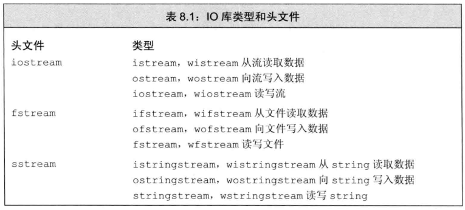

* **IO对象无拷贝或赋值。**
* IO库提供条件状态用于访问和操作流。

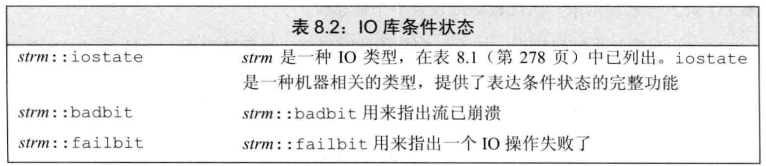

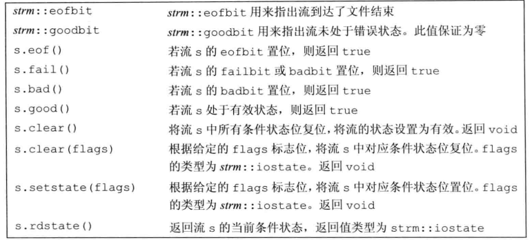

#### 输出缓冲

* 每个输出流都管理一个缓冲区，用于保存程序读写的数据。
* 缓冲机制是为了让操作系统能将多个输出操作合成单一的系统级写操作，带来性能提升。

```c++
cout << "hi" << endl;		// 换行并刷新缓冲区
cout << "hi" << flush;		// 只刷新缓冲区
cout << "hi" << ends;		// 输出空字符然后刷新缓冲区

cout << unitbuf;			// 之后每次输出操作都刷新缓冲区
cout << nounitbuf;			// 回到正常缓冲方式
```

#### 关联输入和输出流

当输入流与输出流关联时，任何从输入流读取数据的操作都会先刷新关联的输出流。

> 标准库默认将cout和cin关联。

```c++
cin.tie(&cout);							// 将cin和cout关联
ostream *old_tie = cin.tie(nullptr);	// cin不与其他流关联，返回old_tie指向当前关联的流
```

### 文件输入输出

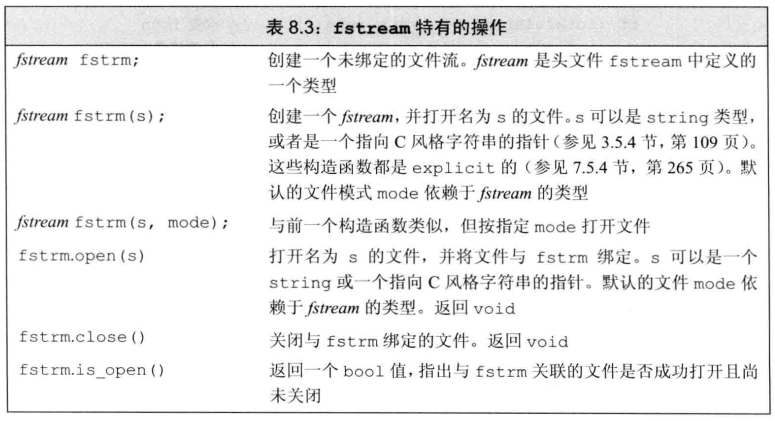

* 当函数接受一个iostream类型引用作为参数时，可以传递给它fstram或sstream对象。

#### 文件模式

每个流都有一个关联的文件模式，用于指出如何使用文件。

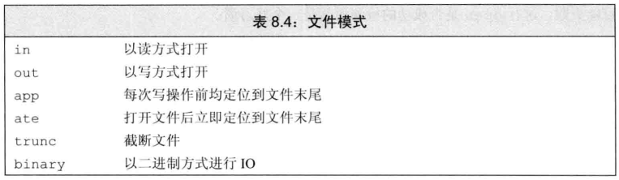

* 通常不设置文件模式则默认out模式，**out模式下打开文件会丢弃已有数据。**

```c++
ofstream out("file1");		// 默认out模式，并截断文件
ofstream out2("file1", ofstream::out);	// 隐含的截断文件
ofstream app("file1", ofstream::app);	// 隐含输出模式
ofstream app2("file1", ofstream::app | ofstream::out)
```

### string流

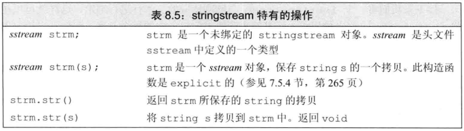

# 第九章 顺序容器

> 容器就是一些特定类型对象的集合。

* 顺序容器为程序员提供了控制元素存储和访问顺序的能力。

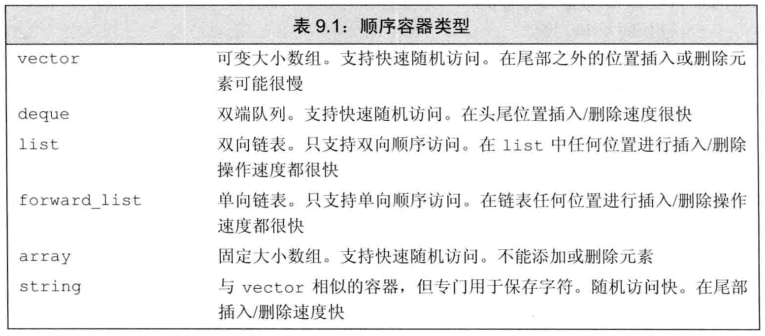

> 拿不定主意就用vector或list。

### 容器库概览

#### 容器通用操作

* 顺序容器、关联容器、无序容器都适用的操作。

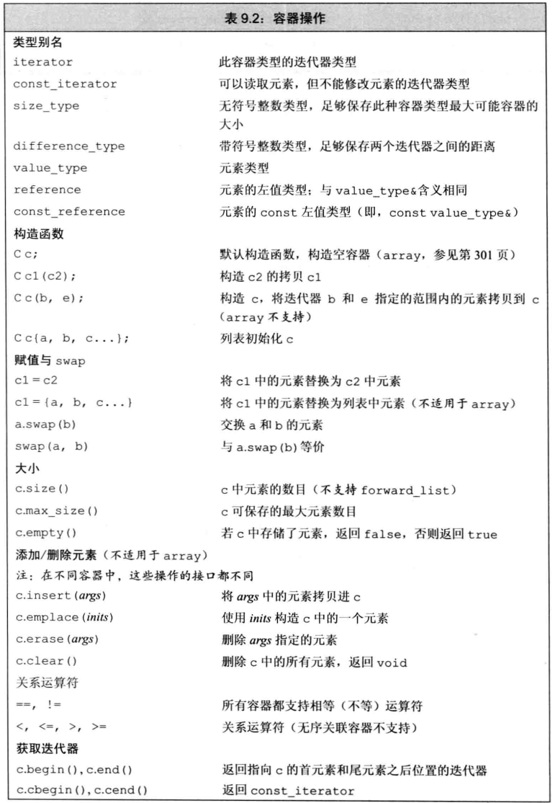

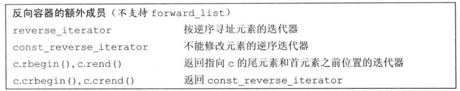

* 反向迭代器执行++操作会获得上一个元素。

#### 容器初始化与定义

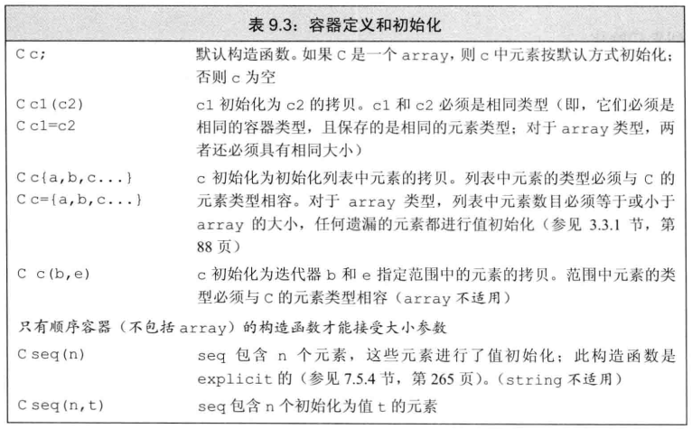

* array具有固定大小。

```c++
array<int, 10> arr;		// 定义一个10个int的标准库数组
```

* 内置类型的数组无法拷贝或对象赋值，但array类型可以。

#### 赋值和swap

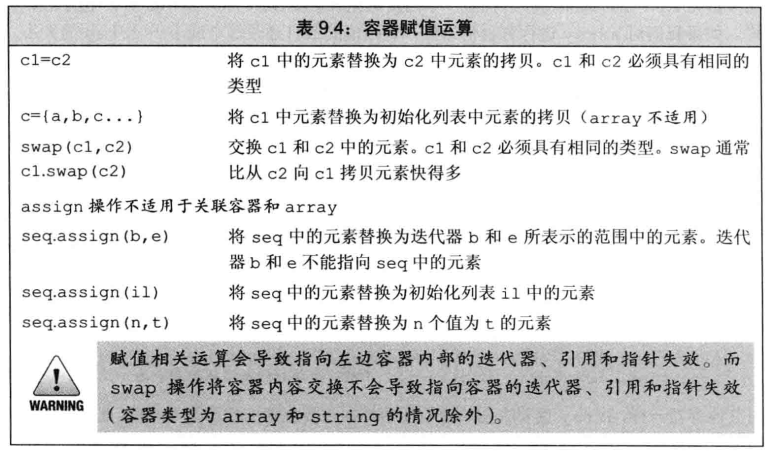

### 顺序容器操作

#### 向顺序容器添加元素

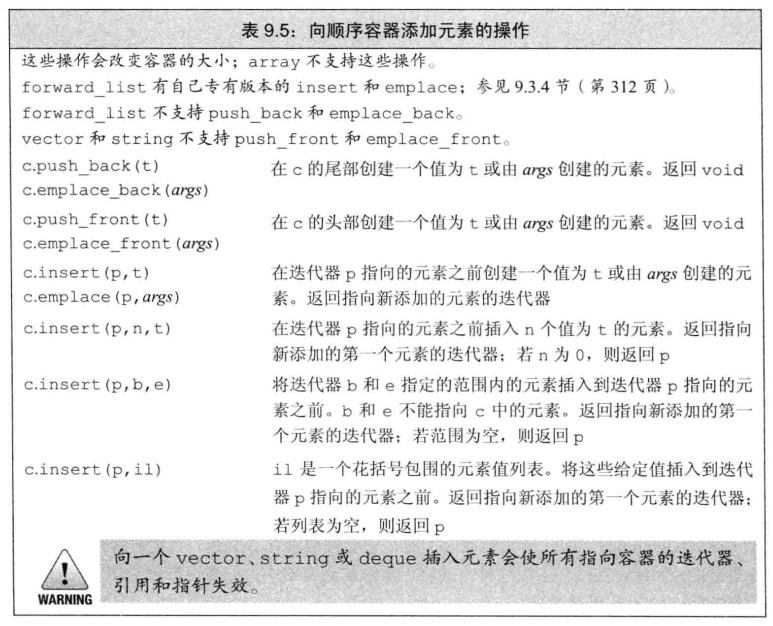

#### 访问元素

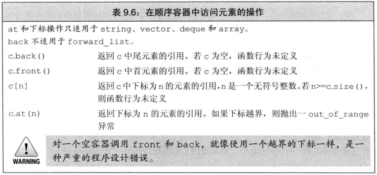

#### 删除元素

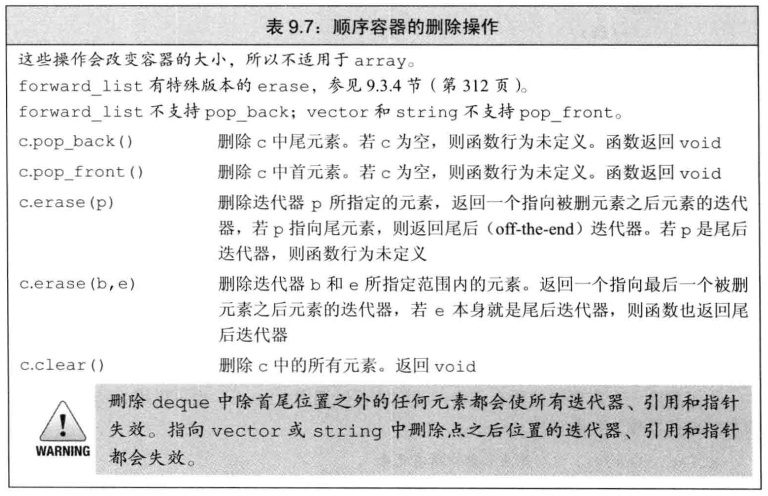

#### forward_list操作

* forward_list定义了berfore_begin，返回首前迭代器。可以在首元素前增加或删除元素。

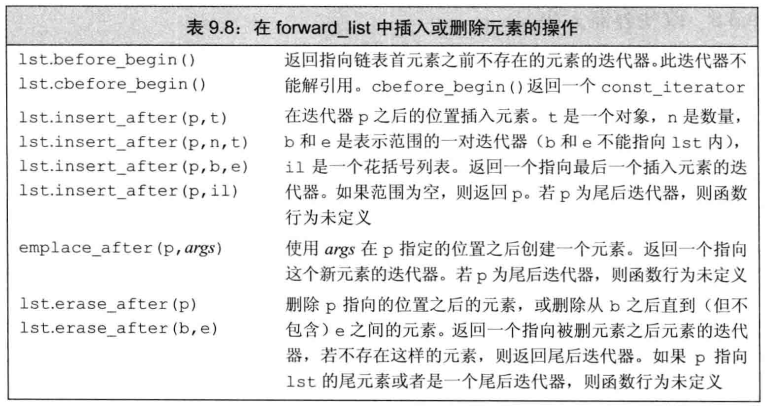

#### 改变容器大小

* resize可以用来增大或缩小容器，当增大时会添加新元素到容器后部，当缩小时容器后部元素会被删除。
* resize只改变元素的数量，不改变容器的容量。

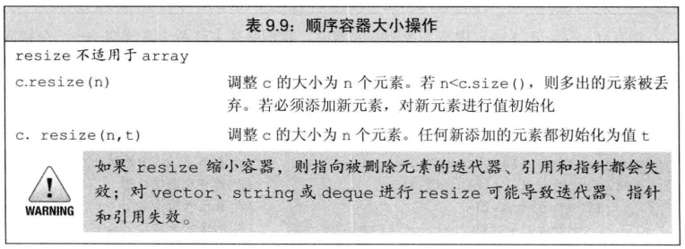

### 管理vector的容量

* vector对象连续存储，当加入新元素时，需要申请内存空间。为了避免反复申请释放内存空间，当不得不获取新的内存空间时，vector和string通常会自动分配比新的空间需求更大的内存空间，预留作为备用。

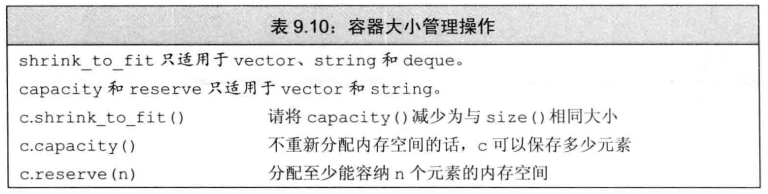

* 容器的size是指它已经保存的元素个数，capacity是不分配新内存情况下最多可以保存多少个元素。

* shrink_to_fit只是请求，并不保证退还内存。

### string操作

#### 构造

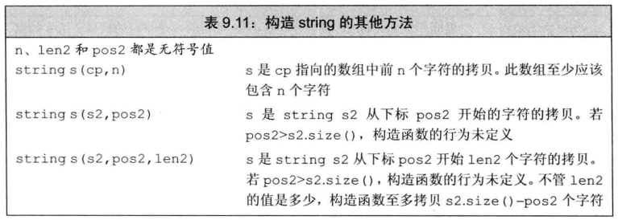

#### 子字符串

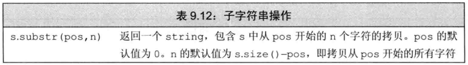

#### 改变字符串

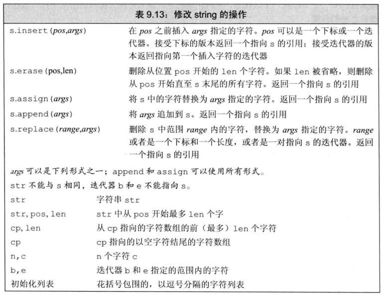

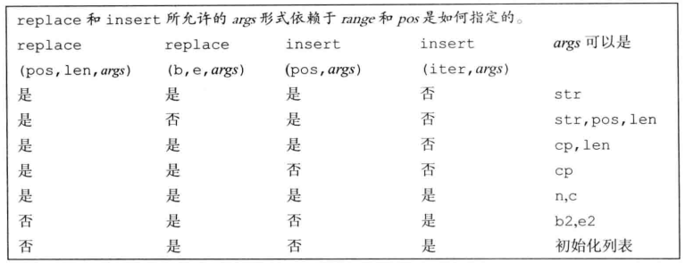

#### 搜索字符串

* 搜索函数返回string::size_type值。

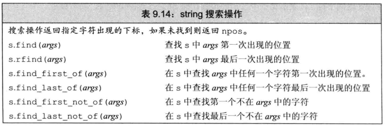

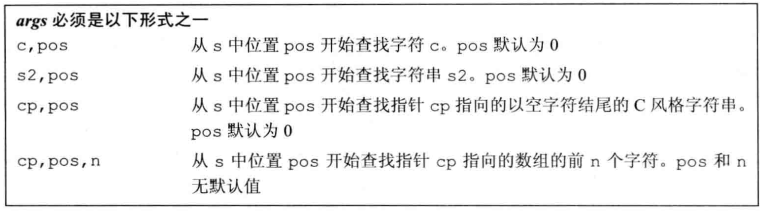

#### compare函数

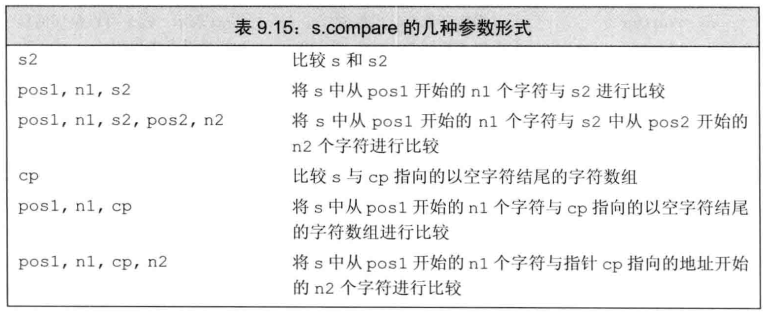

#### 数值转换

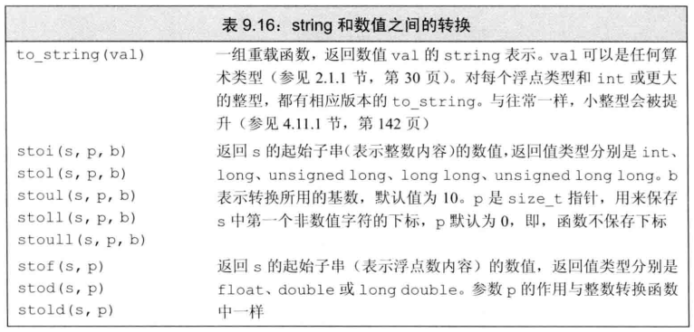

### 容器适配器

适配器是标准库中的一个通用概念。一个适配器是一种机制，能使某种事物的行为看起来像另一种事物。比如stack适配器接收一个顺序容器（除array和forward_list外），并使其操作起来像一个stack。

* 顺序容器适配器：stack、queue、priority_queue。

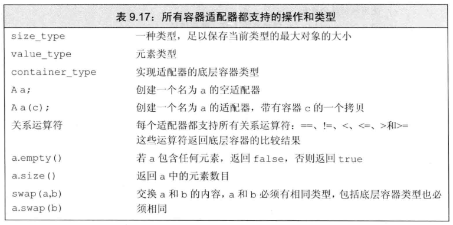

#### 定义

```c++
deque<int> deq;
stack<int> stk(deq);		// 从deq拷贝元素到stk
stack<string, vector<string>> str_stk;	// 在vector上实现空栈
```

#### 栈适配器

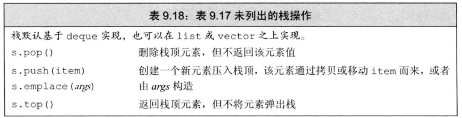

#### 队列适配器

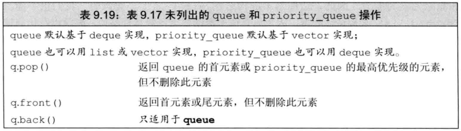

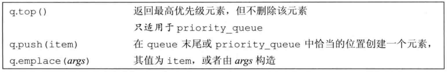

# 第十一章 关联容器

* 关联容器支持高效的关键字查找和访问。
* 两个主要的关联容器类型：
  * map：元素为关键字-值对。
  * set：元素只包含一个关键字。

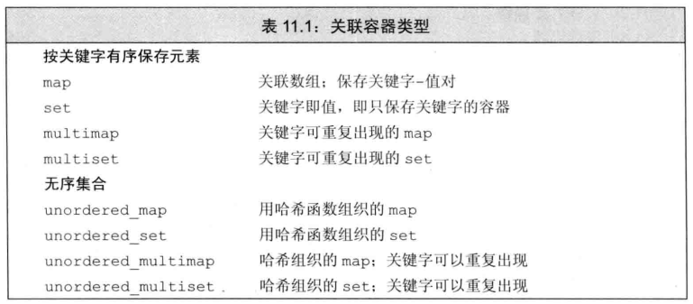

# 第十二章 动态内存

> 静态内存：用于保存局部static对象、类static数据成员、定义在任何函数之外的变量。
>
> 栈内存：函数内的非static对象。
>
> 堆：给程序用于动态分配内存。

* 为了更安全的使用动态内存，标准库提供了两种智能指针，可以自动释放所指对象。

### shared_ptr类

```c++
shared_ptr<string> p1;		// 智能指针是模板
```

* 默认初始化的智能指针中保存一个空指针。

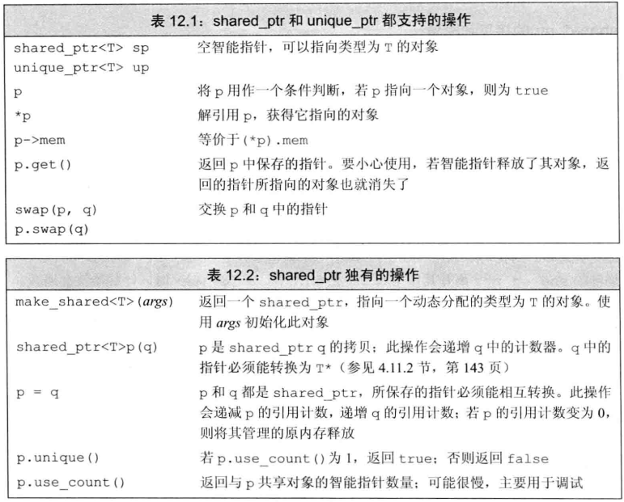

```c++
// make_shared
shared_ptr<int> p3 = make_shared<int>(42);
shared_ptr<string> p4 = make_shared<string>(10,'9');
// shared_ptr的拷贝和赋值
auto p = make_shared<int>(42);
auto q(p);		// q和p指向同一个对象
```

* 每个shared_ptr都有一个引用计数，当给shared_ptr赋新值或销毁，计数器就会递减，当计数器变为0则会自动释放空间。

# 第十三章 拷贝控制

* 类的五种特殊的成员函数：
  * 拷贝构造函数
  * 拷贝赋值运算符
  * 移动构造函数
  * 移动赋值运算符
  * 析构函数

* 上述操作统称为拷贝控制操作

### 拷贝、赋值和构造

> 当类中有指针数据时，必须定义拷贝构造和拷贝赋值，否则在拷贝时，会导致多个指针指向同一位置。若有动态分配内存，却没有释放空间，会导致内存泄露。

#### 拷贝构造函数

* 如果一个构造函数的第一个参数是自身类类型的引用，且任何额外参数都有默认值，则为拷贝构造函数。

```c++
class Foo {
    Foo();				// 默认构造
    Foo(const Foo&);	// 拷贝构造
};
```

##### 合成拷贝构造函数

* 不论是否显式定义拷贝构造函数，编译器都会自动定义一个合成拷贝构造函数。

#### 拷贝赋值运算符

```c++
class Foo {
public:
    Foo& operator=(const Foo&);
    ...
};
```

* 为了与内置类型的赋值保持一致，赋值运算符通常返回一个指向其左侧运算对象的引用。

##### 合成拷贝赋值运算符

* 若未显式定义拷贝赋值运算符，则编译器自动生成一个合成拷贝赋值运算符。

#### 析构函数

* 析构函数名字由波浪号接类名构成，没有返回值，不接受参数。

```C++
class Foo {
public:
    ~Foo();
    ...
};
```

* 析构函数不接受参数，因此无法被重载。
* 内置类型没有析构函数，因此销毁内置类型什么都不需要做。但隐式销毁一个内置指针类型的成员不会delete它所指的对象。

##### 合成析构函数

* 若未显式定义析构函数，则编译器自动生成一个合成析构函数。

#### 阻止拷贝

* 在新标准下，我们可以通过将拷贝构造和拷贝赋值定义为删除的函数来阻止拷贝。
* **删除的函数：**虽然声明了该函数，但是不能以任何方式使用他们。

```c++
struct NoCopy {
    NoCopy(const NoCopy&) = delete;				// 阻止拷贝
    NoCopy& operator=(const NoCopy&) = delete;	// 阻止赋值
};
```

* =delete可以对任何函数使用。
* 析构函数不能被删除。

> 新标准发布前，类通过将其拷贝构造和拷贝赋值声明为private来阻止拷贝。

### 交换操作

> 标准库定义了swap函数用于交换元素。

* 如果一个类定义了自己的swap，那么算法将使用类自定义版本。

```c++
class HasPtr {
    friend void swap(HasPtr&, HasPtr&);
};
inline
void swap(HasPtr &lhs, HasPtr &rhs){
    using std::swap;		// 若swap的类没有定义swap则可使用标准库的swap
    swap(lhs.ps, rhs.ps);
    swap(lhs.i, rhs.i);
}
```

### 对象移动

> 许多类型的对象不能拷贝，但能移动。

#### 右值引用

* 右值引用就是必须绑定到右值的引用。右值引用只能绑定到一个将要销毁的对象。

```c++
int i = 42;
int &&r = i * 42;
```

* 右值要么是字面常量，要么是临时对象，因此右值引用所引用对象将要被销毁，且该对象没有其他用户。

#### 标准库move函数

* 右值引用无法直接绑定到一个左值上，但可以通过move获得绑定到左值上的右值引用。

```c++
int &&r = std::move(r1);
```

* **移后源对象可以被赋值、销毁，但不能使用它的值。**

#### 移动构造函数和移动赋值运算符

* 移动构造函数第一个参数是该类型的右值引用，额外参数需要有默认值。
* 移动构造函数需确保移后源对象若被销毁是无害的。

```c++
StrVec::StrVec(StrVec &&s) noexcept	// 移动操作不抛出异常
    : elements(s.elements), first_free(s.first_free), cap(s.cap)
    {
        s.elements = s.first_free = s.cap = nullptr;	// 确保资源所有权已转交
    }
```

* 移动赋值运算符同理。

##### 合成的移动操作

* 当一个类没有定义任何自己版本的拷贝控制成员，且类的每个非static数据成员都可以移动时，编译器才会合成移动构造或移动赋值。

# 第十四章 重载运算与类型转换

* 当运算符作用于内置类型的运算对象时，无法改变该运算符的含义。

* 只能重载以有运算符，无权发明新运算符。

### 函数调用运算符

### 类型转换运算符

# 第十五章 面向对象程序设计

* 面向对象程序设计的核心思想：
  * 数据抽象
  * 继承
  * 动态绑定
