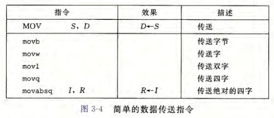
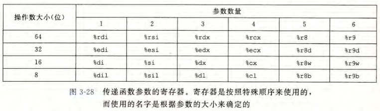

# 第一章 计算机系统漫游

### Unix系统的编译系统

> Unix系统下多采用GNU开发的GCC编译器。


* 编译系统将源文件编译为可执行文件分为四个阶段：
  * 预处理阶段：预处理器根据#开头的的命令修改程序，得到另一个.i文件。
  * 编译阶段：编译器将.i文件翻译成相应汇编语言的.s文本文件。
  * 汇编阶段：汇编器将.s文件翻译成机器语言，并打包成可重定位目标程序，保存在.o文件中。
  * 链接阶段：将多个.o文件合并，生成可执行文件。

# 第二章 信息的表示和处理

> 大多数计算机使用8bit作为最小的可寻址内存单位。
>
> * **虚拟内存：**机器级程序将内存视为非常大的字节数组，称为虚拟内存。
> * **虚拟地址空间：**内存每个字节都由一个唯一的数字标识，成为地址。所有可能地址的集合称为虚拟地址空间。
> * 计算机的位数就是寻址空间的位数，因此位数决定了虚拟地址的范围。

### 寻址和字节顺序

* 一个$w$位的整数，其位表示为$[x_{w-1},x_{w-2},...,x_1,x_0]$，其中$x_{w-1}$为最高有效位，$x_0$为最低有效位。
  * **大端法：**在内存的存储中，最高有效字节在最前面。
  * **小端法：**最低有效字节在最前面。

以变量x为例，其类型为int（4 bit），位于地址0x100处，值为0x01234567。


> Intel大多使用小端法，IBM大多使用大端法。也有一些硬件上支持双端法的，但确定操作系统则确定是大端法还是小端法。

* **许多无符号数运算，尤其无符号数到有符号数的隐式转换可能导致错误或漏洞，因此尽量不使用无符号数。**

### IEEE浮点表示

> 定点表示法不能有效表示非常大的数字，例如$5\times2^{100}$需要上百位来表示。为了解决该问题，IEEE采用类似科学计数法的方式来表示小数。

* **IEEE浮点标准用$V=(-1)^s\times M\times 2^E$的形式表示一个数**
  * $s$决定正负。用一个单独的符号位表示。
  * $M$是一个二进制小数，范围是$[1,2-\epsilon]$。用$n$位的阶码字段$frac=f_{n-1}...f_1f_0$表示。
  * $E$的作用是对浮点数加权（移动小数点）。用$k$位的阶码字段$exp=e_{k-1}...e_1e_0$表示。
    * 较为常见的单精度分配方式是$k=8$，$n=23$，加上符号位是32位。
    * 较为常见的双精度分配方式是$k=11$，$n=52$，加上符号位是64位。


* 根据$exp$的值，有可以分为三种情况：
  * **规格化：**$exp$不全为0也不全为1。
    * 在上述形式中，若要小数点能自由移动而不是局限于正数，采取的方案是将$exp$视为以偏置表示的有符号整数。也就是令$E=e-Bias$，$Bias=2^{k-1}-1$（单精为是127，双精度为1023）。
  * 非规格化：$exp$全为0。
    * 非规格化主要用于表示0和非常接近于0的数。为了让数值能从非规格化平滑过渡到规格化，令$E=1-Bias$。
  * 特殊值：$exp$全为1。
    * $frac$全为0的时候，表示无穷大。
    * $frac$不全为0的时候，表示NaN（Not a Number）。


### 舍入

浮点数的表示方法会限制其范围和精度，因此浮点运算只能近似表示实数运算。IEEE为之定义了四种舍入方式。


* 向偶数舍入可以将中间值以50%的概率向上或者向下舍入，相比其他舍入方式可以避免现实中的统计偏差。

### 浮点运算

* 浮点运算不具有结合性。
  * 浮点加法：$(3.14+1e10)-1e10$结果为0，因为前者在计算时会由于位数不足将较小的值舍入。
  * 浮点乘法：$(1e20*1e20)*1e-20$结果为$+\infty$，因为前者计算会溢出。

# 第三章 程序的机器级表示

> 每种CPU架构有自己的**机器语言指令集**，这些指令集不能从一种CPU架构移植到另一种CPU架构上。**汇编语言是机器语言指令集的人类可读表示**，其本质依然是机器语言。虽然有些CPU架构下的汇编语言指令十分相似，但这更多只是助记符的相似，其底层的二进制机器语言可能会有很大差异。
>
> * 本章所介绍汇编语言基于x86-64。

### 程序编码

* `gcc -Og -o p p1.c p2.c`
  * gcc编译器具有不同的优化等级，为了更好的观察编译结果，本章编译时采用`-Og`，意味着生成符合原始c代码整体结构的优化等级。
* `objdump -d main.o`
  * 反汇编器，用于从机器代码生成汇编代码。

> 或使用gdb：GNU调试工具，可以展示程序的二进制目标代码或者反汇编代码。见csapp P194。

### 数据格式

x86-64指令集通过给指令加后缀的形式，包括了针对字节、字、双字、四字的指令。

* 例如`movb`表示传送字节，`movw`表示传送字，`movl`表示传送双字，`movq`表示传送四字。


### 通用目的寄存器

一个x86-64的CPU包含一组16个**存储64位值**的通用目的寄存器。

* 每个寄存器都可以使用e开头或者d结尾的名称来对其低32位进行操作。
* 粉色的%rsp是栈指针，用于指明运行时栈的结束位置。


### 基本指令

#### 操作数指示符

* 大多数指令需要操作数，操作数的类型有三种：
  * 立即数
  * 寄存器
  * 内存

* 在下图的各种寻址方式中：
  * $后面跟一个整数表示立即数
  * 用$r_a$表示任意寄存器$a$，$R[r_a]$表示寄存器$a$中的值。
  * 用$M_b[Addr]$表示对存储在内存中$Addr$处$b$个字节的值。


#### 数据传送指令（MOV）



* x86-64要求MOV指令的两个操作数不能同时指向内存位置。

#### 压入和弹出栈数据（push和pop）


#### 算术和逻辑操作


> 方便索引：leaq, inc, dec, neg, not, add, sub, imul, xor, or, and, sal, shl, sar, shr

#### 特殊算术操作


> 方便索引：imulq, mulq, clto, idivq, divq

### 控制操作

#### 条件码

* 条件码是CPU维护的一组单个bit的寄存器，用于描述最近算术逻辑操作的属性。常用条件码有：
  * CF：进位标志。最近操作使最高位产生进位。
  * ZF：零标志。最近操作得到结果为0。
  * SF：符号标志。最近操作得到的结果为负。
  * OF：溢出标志。最近操作导致一个补码溢出——正溢出或负溢出。

除了算术逻辑操作会设置条件码之外，还有比较（CMP）和测试（TEST）操作：


##### 访问条件码（SET）


#### 跳转指令（JMP）


* 间接跳转是通过操作数指示符进行跳转，例如：
  * jmp *%rax		该指令用寄存器中的值作为跳转目标。
  * jmp *(%rax)      该指令用%rax中的值作为地址，从该地址的内存中读取跳转目标。

##### 跳转指令的编码

* 跳转指令中的跳转目标用符号标号来编写。汇编器和链接器会产生跳转目标的适当编码：
  * 最常用的PC-relative编码，将目标指令的地址与紧跟在跳转指令后那条指令的地址之间的差作为编码。
  * 给出“绝对”地址也是一种编码方式。

### 条件分支

> 传统实现条件分支的方法是条件控制，即用条件判断然后JMP的方式改变程序的运行路径。
>
> 但现代处理器通过流水线的方式来获得高性能。
>
> 在流水线中，一条指令需要经过一系列的处理，通过重叠连续指令来获得高性能。因此多条指令会在同时运行，这就需要处理器能事先确定要执行的命令序列，才能保证流水线一直充满待执行指令。
>
> 当遇到条件跳转时，处理器需要预测跳转指令是否执行。
>
> 若预测错误，则需要丢掉该跳转指令后的所有工作，因此会导致程序低效。

* 为了解决条件控制的低效，有些情况下可以采用**条件传送**来实现条件分支。
* 条件传送其实就是提前将所有分支的可能的结果都计算好，然后通过简单的比较来选择其中某一个值。
* 例子如下图所示：


* 条件传送指令：


> 方便索引：cmove, cmovne, cmovs, cmovns, cmovg, cmovge, cmovl, cmovle, cmova, cmovae, cmovb, cmovbe

### 过程

* 栈帧：当x86-64过程所需要的存储空间超出寄存器能存放的大小时，就会在栈上分配空间。这部分称为过程的栈帧。

* 大多数栈帧都是定长的，在过程的开始就分配好了。

**栈帧的组成示意图：**


#### 转移控制

* call指令会自动将地址压入栈，ret指令会从栈中自动弹出地址。

#### 数据传送

* 当过程P调用过程Q时，P的代码必须首先把参数复制到适当的寄存器中。当Q返回到P时，P的代码可以访问寄存器%rax中的返回值。
* x86-64中，可以通过寄存器最多传递6个整型（整数和指针）参数，且寄存器的使用有特殊顺序。



* 如果函数有大于6个整形参数，超出6的部分需要压入栈中（参数构造区），参数7位于栈顶，最后被压入。通过栈传递参数，所有数据大小都向8的倍数对齐。这些参数可以通过栈指针%rsp间接访问。

#### 栈上的局部存储

有时候，局部数据必须存放在内存中，这时候也需要用到栈：

* 寄存器不足
* 对局部变量使用地址运算符&，必须产生一个地址
* 局部变量是数组或结构

一般来说，过程通过减小栈指针在栈上分配空间。分配的结果作为栈帧的一部分（局部变量）。

#### 寄存器中的局部存储空间

为了确保当一个过程调用另一个过程时，被调用者不会覆盖调用者稍后会用到的寄存器值，需要设定一组寄存器使用惯例，所有的过程都必须遵守。

* 按照惯例，%rbx、%rbp和%r12～%r15被划分为被调用者保存寄存器。当过程P调用过程Q时，Q必须保存这些寄存器的值，保证它们的值在Q返回P后没有改变。
  * Q可以选择不改变这些寄存器的值。
  * 也可以将原始值压入栈中（被保存的寄存器），返回时从栈中弹出。

* 除上述寄存器和栈指针%rsp，其余寄存器都被分类为调用者保存寄存器。当过程P调用过程Q时，P必须保存这些寄存器的值，保证他们在Q返回后可以复原。

### 数组分配和访问

数组在内存上是一段连续的空间，访问数组元素的时候需要知道数组的类型。

* E是一个元素为4字节的数组，若想计算E[i]，则`movl (%rdx, %rcx, 4), %eax`。其中E的地址存放在%rdx中，i存放在%rcx中，4是伸缩因子，对应数据类型的大小。

> 同理指针运算也是这样操作地址的。

* 多维数组：
  * 多维数组被视为以数组为元素的数组，在内存上以“行优先”的顺序排列。这意味着A[0]在内存中有一段连续的空间存放A\[0][0]、A\[0][1]等元素。
  * 多维数组的索引也和数组同理。

### 异质的数据结构

#### 结构（stuct）

* 和数组类似，结构的所有组成部分都存放在内存中一段连续的区域内，指向结构的指针就是结构第一个字节的地址。
* 编译器负责维护关于每个结构类型的信息，指示每个字段的字节偏移。

#### 联合（union）

联合允许以多种类型来引用一个对象，联合中的元素共享一个内存空间，当使用union中不同元素时，会对原本在使用元素进行覆盖。因此使用联合要确保不同字元素的使用是互斥的。联合所占的空间就是联合中最大元素所占空间。

#### 数据对齐

为了简化形成处理器和内存系统之间接口的硬件设计，许多计算机系统对基本数据类型的合法地址做出一些限制，要求某种类型的地址必须是K（通常是2、4或8）的倍数。

* 汇编指令：`.align 8`指明它后面的数据的起始地址是8的倍数。
* 对于包含结构的代码，编译器可能需要在字段的分配中插入间隙，保证对齐。


### 内存越界引用和缓冲区溢出

C语言对数组引用不进行边界检查，且局部变量和状态信息都存放在栈中。当对越界数组元素进行写操作，会破坏存储在栈中的状态信息，而当程序使用状态信息时就会引发错误。

#### 缓冲区溢出（buffer overflow）

* 当在栈中分配一块空间用于存储数组时，若需要保存的数组大小超过了分配的空间，就会导致缓冲区溢出。缓冲区溢出会修改栈上存储的信息，若是修改了函数的返回地址或是别的信息就会引发严重错误。
  * 缓冲区溢出可以被用于攻击系统安全，让程序执行原本不应该执行的函数。通常，输入给程序一个字符串，其中包含一些可执行的字节编码（攻击代码），另外还有一些字节会指向攻击代码的指针覆盖返回地址。这样当函数返回时就会跳转到攻击代码。

#### 对抗缓冲区溢出攻击

##### 栈随机化

为了在系统中插入攻击代码，攻击者既要插入代码还需要插入指向攻击代码的指针。产生这个指针需要知道这个字符串放置的栈地址。

* 因此可以通过栈随机化，使栈的位置在程序每次运行时都发生变化，使得攻击者无法预测出攻击代码的栈地址。
  * 程序开始时，在栈上分配一段0～n字节的之间的随机大小空间。程序不使用这段空间。
* 地址空间布局随机化（ASLR）是更全面的随机化技术。可以使每次运行时，程序的不同部分都会被加载到内存的不同区域。

##### 栈破坏检测

> 栈随机化与ASLR技术虽然能增加攻击难度，但是并不能完全保障系统安全。

* gcc在产生代码中会加入**栈保护者**机制，检测缓冲区的越界。他在栈帧中任何局部缓冲区与栈状态之间存储一个特殊的**金丝雀**值（哨兵值），这个值在程序每次运行时随机产生。在恢复寄存器状态和从函数返回前，程序检查这个金丝雀值是否被改变，若改变则程序异常中止。


##### 限制可执行代码区域

通过限制哪些内存区域能够存放可执行代码来消除攻击者插入可执行代码的能力。

# 第四章 处理器体系结构

* 指令集结构
  * 状态单元
  * 指令集和编码
  * 编码规范和异常事件处理
* 每个寄存器都有相应的寄存器标识符（register ID），这些寄存器在CPU中的一个以寄存器ID为地址的随机访问存储器中。
* **时钟寄存器（寄存器）：存储单个位或字。时钟信号控制寄存器加载输入值。**
* **随机访问存储器（内存）：存储多个字，用地址来选择读或写哪个字。**
  * 虚拟内存
  * 寄存器文件
* 硬件中说的寄存器和机器级编程说的寄存器并不一致。硬件中的寄存器直接将输入和输出连接到电路的其它部分。机器级编程中的寄存器是指CPU中为数不多的可寻址的字，其地址是寄存器ID，保存在寄存器文件中。为了避免歧义，会用“硬件寄存器”和“程序寄存器”区分这两者。

### SEQ（时序）

* 所有指令所需的计算都可以被组织成6个基本阶段：**取址、译码、执行、访存、写回和更新PC**。

* SEQ的实现包括组合逻辑和两种存储器设备：时钟寄存器（程序计数器和条件码寄存器）和随机访问存储器（寄存器文件、指令内存和数据内存）。
  * 组合逻辑不需要任何时序或控制。
  * 只有四个硬件单元需要对时序进行控制（程序计数器、条件码寄存器、数据内存和寄存器文件）。这些单元的读和写通过一个时钟信号来控制。

### 流水线

> SEQ的时钟信号必须非常慢，以使信号能在一个周期内传播所有的阶段，不能充分利用硬件单元。

* 吞吐量：单位时间内执行命令的总数，以每秒千兆条指令（GIPS）为单位。
* 流水线是通过将组合逻辑拆分为多个阶段，在各个阶段间插入流水线寄存器，通过时钟保存组合逻辑单元的结果。这样每条指令都会经过多个完整的时钟周期，在每个时钟周期中，系统都在执行多条指令的不同阶段。
* 流水线的局限性：
  * 将系统计算划分成一组具有相同延迟的阶段是一个严峻的挑战。处理器中某些硬件的单元无法划分，如ALU和内存。
  * 流水线过深，收益反而下降。流水线寄存器的延迟也会影响吞吐量。

* 带反馈的流水线系统：
  * 多条指令并不是互相独立的，相邻的指令之间可能会有**数据相关**和**控制相关**，即后一条指令会用到上一条指令的计算结果。
  * SEQ设计中，通过反馈路径来解决相关问题。但流水线引入反馈很危险，会改变系统的计算行为。

* 流水线需要每个时钟周期都有一条新指令进入执行阶段并最终完成。当遇到条件分支，需要等到执行阶段之后才能知道是否要选择分支。同理ret也需要通过访存阶段之后才能确定返回地址。
  * 猜测分支方向并根据猜测开始取址的技术称为**分支预测**。

#### 流水线冒险

* 冒险：相关可能导致的流水线计算错误。
  * **数据冒险**
  * **控制冒险**

* 暂停：让一组指令阻塞在它们所处的阶段，而允许其他指令继续通过流水线。但暂停会严重降低系统的吞吐量。
* 转发（旁路）：将结果值直接从一个流水线阶段传到较早阶段。转发需要在基本的硬件结构中增加一些额外的数据连接和控制逻辑。

> 暂停和转发常常结合使用。

# 第六章 存储器层次结构

### 存储技术

* **随机访问存储器（RAM）:**
  * **静态随机访问存储器（SRAM）：**快且贵，用作高速缓存存储器。
    * 每个位存储在一个双稳态的存储器单元中，只要有电就能永远保持它的值，抗干扰能力强。
  * **动态随机访问存储器（DRAM）：**用作主存以及图形系统的帧缓冲区。
    * 每个位存储为对一个电容的充电，可以被制造的很密集，但对干扰非常敏感，且会漏电，因此需要周期性读出重写刷新每一位。
* **只读存储器（ROM）：**
  * 断电后仍可以保存信息。闪存（flash memory）就是一种基于EEPROM的非易失性存储器。
  * 存储在ROM中的程序通常称为固件。当一个计算机通电后，它会运行存储在ROM中的固件。

* 磁盘：由一个或多个盘片组成，盘面的同心圆为磁道，磁道被划分为一组扇区（通常为512byte）。扇区间存在间隙，用于存储标识扇区的格式化位。
  * 对扇区的访问时间分为：寻道时间、旋转时间、传送时间。
  * 磁盘控制器：负责维护逻辑块号和实际物理磁盘扇区之间的映射关系。
  * 主机总线适配器：将一个或多个磁盘连接到I/O总线，使用主机总线接口（如SATA）定义的通信协议。
  * 直接内存访问（DMA）：设备可以自己执行读或写总线事务而不需要CPU干涉的过程。
* 固态硬盘（SSD）：一个SSD封装由一个或多个闪存芯片和闪存翻译层组成。闪存翻译层是一个硬件/固件设备，负责将对逻辑块的请求翻译成对底层物理设备的访问。

### 局部性

* **局部性：**计算机程序常常倾向于引用最近引用过的数据项或和它相邻的数据项。
  * 时间局部性：被引用过一次的内存在不久将再次被引用。
  * 空间局部性：被引用过一次的内存的相邻内存在不久被引用。

### 存储器层次结构

* 存储器层次结构的中心思想：位于k层的更快更小的存储设备作为位于k+1层的更大更慢的存储设备的缓存。

#### 高速缓存

* 每层存储器会被分为块，数据在层间以块作为传送单元来传输。一般而言，层次结构中较低层的设备访问时间长，为了补偿较长访问时间，传输的块会更大。
* 缓存命中：当程序需要第k+1层的某个数据对象d时，会先在第k层查找d，若d恰好缓存在第k层则缓存命中。
* 缓存不命中：第k层没有数据对象d。则需要从第k+1层取出d**替换**或**驱逐**k层中的块，该块称为**牺牲块**。
  * 冷缓存：空的缓存，该不命中称为**强制不命中**或**冷不命中**，是短暂的事件。
  * 放置策略：确定从k+1层取出的数据块放在第k层的哪里。
    * 自由放置，用硬件实现，速度快但定位代价高。
    * 将k+1层某个块限制放置在k层块的子集中，如对k+1层的块求余。限制性的放置策略会引起**冲突不命中**，即多个对象映射到同一个缓存块中，导致明明缓存足够大却一直不命中。
    * 工作集的大小超过缓存大小，会引发**容量不命中**。
* 缓存管理：块的划分、传送和判断是否命中。
  * 寄存器文件——编译器管理
  * L1、L2、L3层缓存——内置在缓存中的硬件逻辑
  * DRAM主存——操作系统软件和CPU上的地址翻译硬件共同管理
  * AFS分布式文件系统，使用本地磁盘作为缓存——AFS客户端进程管理

# 第七章 链接

* **链接：**将各种代码和数据片段收集并组合称为一个单一文件的过程，这个文件可以被加载到内存并执行。

* **链接器的主要任务：**
  * **符号解析：**将每个符号引用正好和一个符号定义关联起来。
  * **重定位：**编译器和汇编器生成从地址0开始的代码和数据节。链接器通过把每个符号定义与一个内存位置关联起来，从而重定位这些节，然后修改所有对这些符号的引用，使得它们指向这个内存位置。
* **目标文件的三种形式：**
  * 可重定位目标文件：包含二进制代码和数据，可以与其他可重定位目标文件合并，创建可执行目标文件。
  * 共享目标文件：特殊的可重定位目标文件，可以在加载或运行时被动态的加载进内存并链接。
  * 可执行目标文件：包含二进制代码和数据，可被复制到内存并执行。

> 现代x86-64 Linux和Unix系统使用**可执行可链接格式（ELF）**。

### 可重定位目标文件

* 可重定位目标文件在格式上可划分为**ELF头**、**节**和**节头部表**：
  * **ELF头**以一个16字节的序列开始，描述生成该文件的系统的字的大小和字节顺序，剩余部分包含帮助链接器语法分析和解释目标文件的信息。
  * **节**分为**.text、.rodata、.data、.bss等**，存储已编译程序的机器代码、只读数据、已初始化的全局和静态变量、未初始化的全局和静态变量等信息。
    * **.symtab**是一个符号表，存放可重定位目标文件中**定义和引用的符号的信息**。符号分三类：
      * **全局符号：**由本文件定义能被其他文件引用，对应于非静态函数和全局变量。
      * **外部符号：**由其他文件定义能被本文件引用的全局符号，对应非静态函数和全局变量。
      * **局部符号：**只能被本文件定义和引用，对应带static的函数和全局变量。
    * 符号表是汇编器构造的，使用编译器输出到汇编语言.s文件中的符号。
  * **节头部表**描述了不同节的位置和大小，其中目标文件中的每个节都有一个固定大小的条目。

### 符号解析

* 链接器解析符号引用的方法：将每个引用与它输入的可重定位目标文件的符号表中的一个确定的符号定义关联起来。
* 全局符号的引用解析会涉及到多个文件定义的符号，情况更为复杂。
  * 多重定义的全局符号：
    * 编译器通过**是否初始化**将每个全局符号分为**强符号**或**弱符号**
    * 链接器通过强弱符号来处理多重定义的符号：
      * 不允许有多个同名强符号
      * 若一个强符号和多个弱符号重名，则选择强符号
      * 若有多个弱符号，则任意选择一个


* **静态库：**将相关的目标文件打包成一个单独的文件。当链接器构造一个输出的可执行文件时，它只复制静态库里被应用程序引用的目标文件。
* 静态库的解析引用：
  * 链接器在符号解析阶段，会**按照文件在编译器驱动命令行上从左到右的出现顺序**来扫描可重定位目标文件和静态库文件。
    * 链接器维护一个**可重定位目标文件集合E**、一个**未解析符号集合U**、一个**已定义符号集合D**
    * 对于链接命令上从左到右的每个文件，链接器会判断它是否为可重定位目标文件，若是则放入E中，并修改U和D来反映文件中的符号定义和引用。
    * 若该文件是静态库文件，则链接器尝试将U中未解析的符号和静态库文件中定义的符号进行匹配。若有定义U中的符号，则将该符号对应的可重定位目标文件放入E中，并删除U中对应符号，将该符号放入D中（放入E中的目标文件的符号也需要进行U或E的分类）。
    * 对输入文件扫描完成后，若U是非空的则输出一个错误并停止。若U为空，则链接器会合并和重定位E中的目标文件，构建输出的可执行文件。
  * **链接命令中文件的顺序会影响到编译的正确与否。**
    * **将静态库文件放在命令末尾。**若先处理静态库文件，则U为空，静态库文件中所有成员目标文件都会被丢弃，因此后续处理可重定位目标文件无法解析引用。
    * **考虑静态库文件间的依赖关系。**若某个静态库文件A中的目标文件a需要引用其他静态库文件B中的目标文件b定义的符号，则在命令中A需要出现在B之前，否则也会出现无法解析引用的问题。若静态库A和静态库B中的符号存在*交叉引用*，则需要在命令中采用ABA或BAB的解法。当然也可以将A和B合并为一个静态库文件解决上述问题。

### 重定位

* 重定位步骤：
  * **重定位节和符号定义：**
    * 链接器将所有相同类型的节合并为同一类型的新的聚合节。
    * 然后，链接器将运行时内存地址赋给新的聚合节，赋给输入模块定义的每个节，以及赋给输入模块定义的每个符号。
  * **重定位节中的符号引用：**
    * 链接器通过**重定位条目**修改代码节和数据节中对每个符号的引用，使得它们指向正确的运行地址。
    * **重定位条目：**
      * 汇编器生成目标文件时，它并不知道数据和代码最终存放在内存的什么位置。也不知道这个文件引用的任何外部定义的函数或全局变量的位置。对于这些最终位置未知的目标引用，汇编器会生成一个重定位条目，用于告诉链接器在将目标文件合并成可执行文件时如何修改这个引用。
      * 其中代码的重定位条目放在.rel.text中，已初始化数据的重定位条目放在.rel.data中。

### 加载可执行目标文件

* 可执行目标文件被设计的很容易加载到内存，可执行文件连续的片被映射到连续的内存段。
* 
* shell通过调用驻留在存储器中称为**加载器**的操作系统代码来运行程序。
  * 加载器将可执行目标文件中的代码和数据从磁盘复制到内存中，然后通过跳转到程序的第一条指令或入口点来运行该程序。
  * 当加载器运行时，它创建一个内存映像，并在程序头部表的引导下，将可执行文件的片复制到代码段和数据段。
  * **加载：**将程序复制到内存并运行的过程。


### 动态链接共享库

> * 静态库的缺陷：
>   * 定期维护和更新静态库需要了解该库的更新情况并将程序与更新了的库重新链接。
>   * 常用函数的代码会被复制到每个运行进程的文本段中，占用内存资源。

* **共享库**是一个目标模块，在运行或加载时，可以加载到任意的内存地址，并和一个在内存中的程序链接起来。
* 链接共享库的过程称为**动态链接**，是由一个叫**动态链接器**的程序来执行。
* 共享方式：
  * 对给定文件系统，所有引用某个库的可执行目标文件共享该库的代码和数据，不需要复制和嵌入到它们的可执行文件中。
  * 在内存中，一个共享库的.text节的一个副本可以被不同的正在运行的进程共享。
* 当创建可执行文件时，静态执行一些链接，然后**在程序加载时，动态完成链接过程**。链接器只复制了一些重定位和符号表信息，使得运行时可以解析程序中的代码和数据的引用。

* 应用程序被加载执行前，动态链接器加载和链接共享库的情况：
  * 加载器加载**部分链接的可执行文件**。
  * 部分链接的可执行文件中包含一个.interp节，这一节包含动态链接器的路径名。
  * 加载和运行**动态链接器**（动态链接器也是共享目标）：
    * 重定位每个动态库的文本和数据到某个内存段。
    * 重定位部分链接的可执行文件中所有由动态库定义的符号的引用。
    * 动态链接器将控制传递给应用程序。
* 应用程序在运行时，动态链接器加载和链接共享库的情况：
  * Linux系统为动态链接器提供了一个简单的接口，允许应用程序在运行时加载和链接共享库。
  * 在头文件`dlfcn.h`下的函数`void *dlopen(const char *filename, int flag);`负责加载和链接共享库`filename`，若成功则返回指向句柄的指针，错误则为NULL。
  * `void *dlsym(void *handle, char *symbol);`函数的输入为共享库的句柄和一个符号的名字，若该符号存在则返回符号的地址，否则返回NULL。
  * `int dlclose(void *handle);`函数在没有其他共享库在使用`handle`这个共享库，则卸载该共享库。
  * `const char *dlerror(void);`函数返回一个字符串，描述调用上述函数时发生的错误，没有错误则返回NULL。

> Java定义了一个标准调用规则，叫做Java本地接口（JNI），它允许Java程序调用本地的C和C++函数。JNI的基本思想是将本地C函数编译到一个共享库中。当一个正在运行的Java程序试图调用该C函数时，Java解释器利用dlopen接口或类似接口动态链接和加载该共享库，然后调用该库中的C函数。

# 第八章 异常控制流

* 从给处理器加电开始，直到断电为止，程序计数器假设一个值的序列$a_0,a_1,...,a_{n-1}$。其中，$a_k$是某个相应指令$I_k$的地址。每次从$a_k$到$a_{k+1}$的过渡称为**控制转移**。这样的控制转移序列叫做处理器的**控制流**。
* 现代系统通过使控制流发生突变来对系统状态变化作出反应，这些突变称为**异常控制流（ECF）**。

### 异常

* **异常：**控制流中的突变，用来响应处理器状态中的某些变化。
* 异常是异常控制流的一种形式，它一部分由硬件实现，一部分由操作系统实现。
* 在任何情况下，当处理器检测到有事件发生时，它就会通过一张叫做**异常表**的跳转表，进行一个间接过程调用，到一个专门设计用来处理这类事件的操作系统子程序（**异常处理程序**）。
* 异常的类别：**中断、陷阱（常用于系统调用）、故障、终止**。

### 进程

* **进程：一个执行中程序的实例。**
* 系统中的每个程序都运行在某个进程的**上下文**中，上下文是由程序正确运行所需的状态组成的。
* **逻辑控制流：**某个运行中的程序的PC值序列。
* **并发流：**一个逻辑流在执行时间上与另一个流重叠。这两个流被称为**并发的运行**。
  * 多个流并发的执行的一般现象被称为**并发**。
  * 一个进程和其他进程轮流运行的概念称为**多任务**。
  * 一个进程执行它的控制流的一部分的每一时间段叫做**时间片**。
* 操作系统内核使用一种称为**上下文切换**的较高层形式的异常控制流来实现多任务。
  * 内核为每个进程维持一个上下文。
    * 上下文：内核重新启动一个被抢占的进程所需的状态。
  * 在进程执行的某些时刻，内核可以决定抢占当前进程，并重新开始一个先前被抢占了的进程。这种决策叫做**调度**，是由内核中称为**调度器**的代码处理的。

### 进程控制

* Unix提供了大量从C程序中操作进程的系统调用。

#### 获取进程ID

* 每个进程都有一个唯一的正数进程ID（PID）。

```c
#include <sys/types.h>
#include <unistd.h>

pid_t getpid(void);		// 返回调用进程的PID
pid_t getppid(void);	// 返回它的父进程的PID
```

#### 创建和终止进程

* 进程的三种状态：
  * **运行。**进程要么在CPU上执行，要么在等待被执行且最终会被内核调度。
  * **停止。**进程的执行被挂起，且不会被调度。
  * **终止。**进程永远的停止了。

```c
#include <stdlib.h>

pid_t fork(void);			// 子进程返回0，父进程返回子进程的PID
void exit(int status);		// status为退出状态
```

* 子进程和父进程的地址空间是相同但是独立的。

#### 回收子进程

* 当一个进程由于某种原因终止时，内核并不是立即把它从系统中清除。相反，进程被保持在一种已终止的状态中，直到被它的父进程**回收**。
* 一个终止了但还未被回收的进程称为**僵死进程**。
* 若父进程终止，内核会安排init进程成为它的孤儿进程的养父。
  * init进程的PID为1，是在系统启动时由内核创建的，它不会终止，是所有进程的祖先。

```c
#include <sys/types.h>
#include <sys/wait.h>

pid_t waitpid(pid_t pid, int *statusp, int options);
```

* 默认情况下`options = 0`，waitpid挂起调用进程的执行，直到它的等待集合中的一个子进程终止。

```c
#include <sys/types.h>
#include <sys/wait.h>

pid_t wait(int *statusp);	// waitpid简化版
```

#### 让进程休眠

```c
#include <unistd.h>

unsigned int sleep(unsigned int secs);		// 返回还要休眠的秒数
int pause(void);							// 休眠直至该进程受到一个信号
```

#### 加载并运行进程

* execve函数在当前进程的上下文中加载并运行一个新程序。

```c
#include <unistd.h>

int execve(const char *filename, const char *argv[], const char *envp[]);
```

* execve函数加载并运行可执行目标文件filename，且带参数列表argv和环境变量列表envp。
* execve函数在当前进程上下文中加载并运行一个新的程序。它会覆盖当前进程的地址空间，但并没有创建一个新的进程。新的程序仍有相同的PID，并且继承了调用execve函数时已打开的所有文件描述符。

### 信号

* **信号：**一条通知进程系统中发生了某种类型的事件的小消息。
* 传送信号到目的进程的步骤：
  * **发送信号。**内核通过更新目的进程上下文中的某个状态，发送一个信号给目的进程。
    * 内核检测到一个系统事件。
    * 一个进程调用了`kill`函数。
  * **接收信号。**当目的进程被内核强迫以某种方式对信号的发送做出反应时，它就接收了信号。
    * 目标进程忽略该信号。
    * 目标进程终止。
    * 目标进程通过执行一个称为**信号处理程序**的用户层函数**捕获**这个信号。
* **待处理信号：**一个发出而没有接收的信号。
  * 在任何时刻，一种类型至多只会有一个待处理信号。如果一个进程有一个类型k的待处理信号，那么接下来发送到这个进程的类型为k的信号都不会排队等待，而是被简单的丢弃。
  * 当一种信号被**阻塞**，它仍可以发送，但是产生的待处理信号不会被接收，直到进程取消对这种信号的阻塞。

#### 发送信号

* 用`/bin/kill`程序发送信号：`/bin/kill -9 15213`，`-9`表示发送信号9（SIGKILL）。

* 从键盘发送信号：Ctrl+C发送SIGKILL到前台进程组的每个进程，Ctrl+Z发送SIGTSTP到前台进程组的每个进程。

* 用`kill`函数发送信号：

  ```c
  #include <sys/types.h>
  #include <signal.h>
  
  int kill(pid_t pid, int sig);		// sig是信号号码
  ```

* 用`alarm`函数发送信号：

  ```c
  #include <unistd.h>
  
  unsigned int alarm(unsigned int secs);		// 内核在secs秒后发送一个SIGALARM给调用进程
  ```

#### 接收信号

* **当内核把进程p从内核模式切换到用户模式时，它会检查进程p的未被阻塞的待处理信号的集合（pending&~blocked）。**

  * 若集合为空，则内核将控制传递到p的逻辑控制流中的下一条指令。
  * 若集合非空，则内核选择集合中某个信号k，并强制p接收信号k。收到信号的进程会处罚某种行为，完成该行为后控制传递回p的逻辑控制流的下一条指令。

* 每个信号类型都有一个预定义的默认行为：

  * 进程终止。
  * 进程终止并转储内存。
  * 进程停止（挂起）直到被SIGCONT信号重启。
  * 进程忽略该信号。

* 进程可以通过`signal`函数修改和信号关联的默认行为：

  ```c
  #include <signal.h>
  typedef void (*sighandler_t)(int);
  
  sighandler_t signal(int signum, sighandler_t handler);
  ```

  * `handler`若为用户定义的函数的地址，这个函数被称为**信号处理程序**，只要接收到类型为`signum`的信号就会调用该程序。改变信号的默认行为称为**设置信号处理程序**。调用信号处理程序称为**捕获信号**，执行信号处理程序称为**处理信号**。

* 信号处理程序可以被其他信号处理程序中断。

#### 阻塞和解除阻塞信号

* Linux的阻塞信号机制：

  * **隐式阻塞机制。**内核默认阻塞任何当前处理程序正在处理信号类型的待处理的信号。

  * **显式阻塞机制。**通过`sigprocmask`函数及其辅助函数，明确阻塞或解除阻塞选定信号。

    ```c
    #include <signal.h>
    
    int sigprocmask(int how, const sigset_t *set, sigset_t *oldset);
    int sigemptyset(sigset_t *set);
    int sigfillset(sigset_t *set);
    int sigaddset(sigset_t *set, int signum);
    int sigdelset(sigset_t *set, int signum);
    int sigismember(const sigset_t *set, int signum);
    ```


# 第九章 虚拟内存

* **虚拟内存：**现代系统对主存的抽象概念。概念上而言，虚拟内存被组织为一个由存放在磁盘上的N个连续的字节大小的单元组成的数组。

* **物理地址（PA）：**计算机系统的主存被组织成一个由M个连续的字节大小的单元组成的数组，每个字节都有一个唯一的编号。
* **虚拟地址（VA）：**CPU生成的，可以被**内存管理单元（MMU）**转换为相应物理地址，然后用于访问主存。
* VM系统将虚拟内存分割为大小固定的**虚拟页（VP）**，物理内存也被分割为**物理页（PP）**。

### 页表

* **页表：**存放在物理内存中的数据结构，用于将虚拟页映射到物理页。
* **页表条目（PTE）**的数组组成页表，虚拟地址空间中每个页在页表中一个固定偏移量处都有一个PTE。
* **操作系统为每个进程提供一个独立的页表，也就是一个独立的虚拟地址空间。**
* 可以通过在PTE上添加一些额外的许可位来控制对一个虚拟页面内容的访问，用于内存保护。

### 地址翻译

* CUP中的一个控制寄存器，**页表基址寄存器（PTBR）**指向当前页表。
* n位的虚拟地址包含两个部分：p位的**虚拟页面偏移（VPO）**、（n-p）位的**虚拟页号（VPN）**。
* MMU利用VPN来选择适当的PTE。
* 将适当的PTE中的**物理页号（PPN）**和**虚拟页面偏移（VPO）**串联起来就得到了物理地址。VPO和**物理页偏移（PPO）**是相同的。


* 页面命中时，CPU硬件的执行步骤：
  * 处理器生成虚拟地址VA，把它传送给MMU。
  * MMU生成PTE地址PTEA，并从高速缓存/主存请求得到它。
  * 高速缓存/主存向MMU返回PTE。
  * MMU构造物理地址，并把它传送给高速缓存/主存。
  * 高速缓存/主存返回所请求的数据字给处理器。


* 缺页时，需要硬件和操作系统内核协作完成：
  * 与页面命中的前三步相同。
  * PTE中有效位为0，因此MMU触发一次异常，传递CPU中的控制到操作系统内核中的缺页异常处理程序。
  * 缺页处理程序确定出物理内存中的牺牲页，如果这个页已经被修改，则将它换出到磁盘。
  * 缺页处理程序页面调入新的页面，并更新内存中的PTE。
  * 缺页处理程序返回到原来的进程，再次执行导致缺页的指令。


### 利用TLB加速地址翻译

> 每次CPU产生一个虚拟地址，MMU就必须查阅一个PTE。从内存中取数据需要的周期数远超从L1中取数据。

* **快表（TLB）：**MMU中一个关于PTE的小的缓存。TLB是一个小的、虚拟寻址的缓存，其中每一行都保存着一个由单个PTE组成的块。
* 按照TLB的组数t，将VPN分为t位的**TLB索引（TLBI）**和剩余位的**TLB标记（TLBT）**。


* TLB命中的情况下，所有地址翻译步骤都是在芯片上的MMU执行的，因此非常快。


### 多级页表

> 若32位系统，4KB页面，4字节PTE，则页表大小为4MB。对于64位系统来说，页表就过大了。应次需要使用**层次结构的页表**来压缩页表。

* 一级页表中的每个PTE负责映射虚拟地址空间中一个片（chunk），一个片由多个连续的页组成。
* 若片i 中每个页面都未被分配，则一级PTE i 就为空。
* 若片i 中至少一个页是分配了的，则一级PTE i就指向一个二级页表的基址。
* 二级页表中的每个PTE负责映射一个虚拟内存页面。

#### 多级页表的地址翻译

* 假设使用k级页表层次结构，虚拟地址被划分为k个VPN和1个VPO。
* 每个VPN i都是一个到第i 级页表的索引。
* 第j 级页表中的每个PTE，都指向第j+1 级的某个页表的基址。
* 第k 级页表中的每个PTE包含某个物理页面的PPN，或者一个磁盘块的地址。


### 内存映射

* Linux通过将一个虚拟内存区域与一个磁盘上的**对象**关联起来，以初始化这个虚拟内存区域的内容，这个过程称为**内存映射**。
* **对象：**
  * Linux文件系统中的普通文件。
  * 匿名文件。由内核创建，包含的全市二进制零。
* 一个对象可以被映射到虚拟内存的一个区域，要么作为**共享对象**，要么作为**私有对象**。
  * 如果一个进程将一个共享对象映射到它的虚拟地址空间的一个区域内，那么这个进程对这个区域的任何写操作，对于那些也把这个共享对象映射到它们虚拟内存的其他进程而言，也是可见的。而且，这些变化也会反映在磁盘的原始对象中。
  * 对于一个映射到私有对象的区域做的改变，对于其他进程来说是不可见的，并且进程对这个区域所作的任何写操作都不会反映在磁盘的对象中。
* **私有对象**使用**写回复制**来实现映射到虚拟内存。
  * 当多个进程映射了私有对象时，这些进程共享这个对象的同一个物理副本。
  * 对于每个映射私有对象的进程，相应私有区域的页表条目都被标记为只读，并且区域结构被标记为**私有的写时复制**。
  * 只要没有进程试图写它自己的私有区域，它们就可以继续共享物理内存中对象的一个单独副本。
  * 然而，只要有一个进程试图写私有区域内的某个页面，那么这个写操作就会触发一个保护故障。
    * 当故障处理程序注意到保护异常是由于进程试图写私有的写时复制区域中的一个页面而引起的，它就会在物理内存中创建这个页面的一个新副本，更新页表条目指向这个新的副本，然后恢复这个页面的可写权限。
* Linux进程可以使用`mmap`函数来创建新的虚拟内存区域，并将对象映射到这些区域中：

```c
#include <unistd.h>
#include <sys/mman.h>

void *mmap(void *start, size_t length, int prot, int flags, int fd, off_t offset);
```

* `mmap`函数要求内核创建一个新的虚拟内存区域，最好是从地址start开始的一个区域，并将文件描述符fd指定的对象的一个连续的片映射到这个新的区域。连续的对象片大小为length字节，从距文件开始处偏移量为offset字节的地方开始。

* `munmap`函数删除虚拟内存的区域：

```c
#include <unistd.h>
#include <sys/mman.h>

int munmap(void *start, size_t length);
```

### 动态内存分配

* **动态内存分配器**维护着一个进程的虚拟内存区域，称为**堆**。
* 对于每个进程，内核维护着一个变量brk，它指向堆的顶部。
* 分配器将堆视为一组大小不同的**块**的集合来维护。每个块就是一个连续的**虚拟内存片**，要么是已分配，要么是空闲的。
* **显式分配器：**要求应用显式的时方任何已分配的块。例如malloc和free，new和delete。
* **隐式分配器：**分配器自动检测一个已分配块何时不被程序所使用，那么就释放这个块。也称为**垃圾收集器**，例如Java之类的高级语言就依赖垃圾收集器释放已分配的块。
* 造成堆利用率很低的主要原因是一种称为**碎片**的现象：虽然有未使用的内存但不能满足分配请求。
  * **内部碎片：**已分配块比有效载荷大，例如对齐约束导致实际分配块比所需块多。
  * **外部碎片：**空闲内存合计起来足够满足一个分配请求，但没有一个单独的空闲块足够大可以处理这个请求。

# 第十章 系统级I/O

* **输入/输出（I/O）**是在主存和外部设备（例如磁盘驱动器、终端和网络）之间复制数据的过程。

### Unix I/O

* 一个**Linux文件**就是一个m个字节的序列$B_0,B_1,...,B_{m-1}$。
* 所有I/O设备（网络、磁盘、终端等）都被模型化为文件，所有的输入输出都被当作对相应文件的读和写来执行。
* 因此，Linux内核可以引出一个简单、低级的**应用接口**，称为**Unix I/O**，使得所有的输入输出都能以一种统一且一致的方式来执行：
  * 打开文件。内核会返回一个小的非负整数，叫做**描述符**，用于标识这个文件。Linux shell创建的每个进程开始时都有三个打开的文件：**标准输入（0）**、**标准输出（1）**、**标准错误（2）**。
  * 改变当前文件位置。对于每个打开的文件，内核保持一个**文件位置k**，记录从文件开头起始的字节偏移量。可通过`seek`操作显式的设置文件当前位置k。
  * 读写文件。读操作就是从文件复制n个字节到内存，写操作就是从内存复制n个字节到文件。
  * 关闭文件。

### 文件

* 每个Linux文件都有一个**类型**来表明它在系统中的角色：
  * **普通文件。**包含任意数据，又被分为**文本文件**和**二进制文件**，但对内核而言这两者没有区别。
  * **目录。**包含一组**链接**的文件，其中每个链接都将一个文件名映射到一个文件，这个文件可能是另一个目录。每个目录至少有两个条目：`.`是到该目录自身的链接，`..`是到该目录层次结构中父目录的链接。
  * **套接字。**用于与另一个进程进行跨网络通信的文件。

### 打开和关闭文件

* 进程通过调用open函数来打开一个已存在的文件或者创建一个新文件。

```c
#include <sys/types.h>
#include <sys/stat.h>
#include <fcntl.h>

int open(char *filename, int flags, mode_t mode);		// 成功返回文件描述符，出错为-1

```

```c
#include <unistd.h>

int close(int fd);		// 成功为0，出错为-1
```

### 读和写文件

* 应用程序通过read和write函数来执行输入和输出。

```c
#include <unistd.h>

ssize_t read(int fd, void *buf, size_t n);			// 成功为读的字节数，若EOF为0，若出错为-1
ssize_t write(int fd, const void *buf, size_t n);	// 成功为写的字节数，若出错为-1
```

* **不足值**：read和write传送的字节比应用程序要求的少。

### 读取文件元数据

* 应用程序能通过调用stat和fstat函数，检索文件的信息。

```c
#include <unistd.h>
#include <sys/stat.h>

int stat(const char *filename, struct stat *buf);
int fstat(int fd, struct stat *buf);
```

* stat函数以一个文件名`filename`为输入，填写`stat`数据结构中的各个成员。

### 读取目录内容

* 应用程序可以用readdir系列函数来读取目录内容。

```c
#include <sys/types.h>
#include <dirent.h>

DIR *opendir(const char *name);		// 输入路径名，返回指向目录流的指针
struct dirent *readdir(DIR *dirp);	// 返回指向流dirp中下一个目录项的指针
int closedir(DIR *dirp);			// 关闭流并释放其所有资源
```

